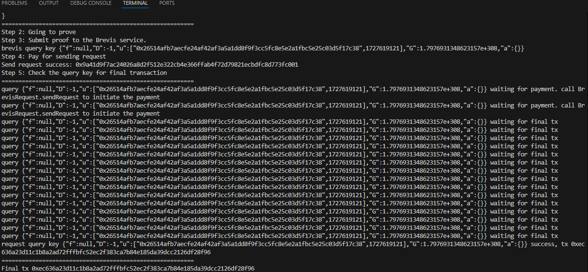

## Overview

Our project uses the Brevis SDK and services to generate proofs for calculated results. These results, including the mean and standard deviation, will be used in V4 Hooks to determine volatile periods and generate reward token amounts.

## Installation

### [Brevis App](/brevis-integration/app/)

You need to setup the .env file first.

| Environment variable | Required | Description |
| -------- | ------- |--------|
|ACCOUNT_PRIVATE_KEY|✅ | Your account private key|
|GET_BLOCK_BSC_TESNET_ACCESS_TOKEN|✅| getBlock.io access token for BSC testnet|
|GET_BLOCK_BSC_MAINNET_ACCESS_TOKEN|✅|getBlock.io access token for BSC mainnet|
|GET_BLOCK_MAINNET_TOKEN|✅| getBlock.io access token for Ethereum mainnet|
|GET_BLOCK_SEPOLIA_ACCESS_TOKEN|✅| getBlock.io access token for Sepolia|

If you use common public nodes, you may encounter an "exceed limit" error, so we use GetBlock.io nodes to avoid that. You can also use other node providers.

To install nodeJS libraries:
- ```npm i```

### [Contracts](/brevis-integration/contracts/)

You need to setup the .env file first.

| Environment variable | Required | Description |
| -------- | ------- |--------|
|ACCOUNT_PRIVATE_KEY|✅ | To deploy your smart contracts|
|BSC_TESTNET_RPC_URL|✅| Public RPC URL|
|BSCSCAN_API_KEY|✅|To verify smart contracts|

Use commands:
- ```forge install```
- ```source .env```

### [Prover](/brevis-integration/prover/)

You should use WSL or Linux for Prover service development. Check the go.mod and Makefile to ensure the app information is correct.

## Testing

### Contract

We implemented two main contracts:
- [CLVolatilePeriodRewardHook](/brevis-integration/contracts/src/pool-cl/CLVolatilePeriodRewardHook.sol): Supports OP-MODE, but it has not been fully tested in the real environment.

- [CLVolatilePeriodRewardHookZK](/brevis-integration/contracts/src/pool-cl/CLVolatilePeriodRewardHookZK.sol): Supports ZK-MODE only. Fully tested and already deployed on the BSC testnet.

To run script test:
- ```forge test -vv --match-path test/pool-cl/*ZK.t.sol```: Automation test script for the CLVolatilePeriodRewardHookZK contract.
- ```forge test -vv --match-path test/pool-cl/*.t.sol```: Automation test scripts for all hook contracts in pool-cl.

To deploy and verify the CLVolatilePeriodRewardHookZK contract:
- ```forge script --chain bsc-testnet --sender your_account_address_here script/CLHookScript.s.sol:CLHookScript --rpc-url $BSC_TESTNET_RPC_URL --broadcast --verify -vvvv```

To deploy and verify the CLVolatilePeriodRewardHookZK contract:

- ```forge script --chain bsc-testnet --sender your_account_address_here script/CLHookOPScript.s.sol:CLHookOPScript --rpc-url $BSC_TESTNET_RPC_URL --broadcast --verify -vvvv```

Please save the contract address for later use.

### Prover
We have two main circuits:
- [Circuit using storage slot data](brevis-integration/prover/circuits/storage/circuit.go)
- [Circuit using receipt data](brevis-integration/prover/circuits/receipt/circuit.go)

To run a prover service: ```make start```. The default setting in [main.go](brevis-integration/prover/cmd/main.go) supports [Circuit using Receipt data](brevis-integration/prover/circuits/receipt/circuit.go). If you want to start a service that supports [Circuit using Storage slot data](brevis-integration/prover/circuits/storage/circuit.go), please modify main.go.

For testing:
- ```cd brevis-integration/prover/circuits/storage/; go test```
- ```cd brevis-integration/prover/circuits/receipt/; go test```

## Run the full workflow.

### Start prover

- ```make start```: copy vk_hash
### Update hook contract
- Go to the smart contract page on the testnet scan.
- Navigate to the "Write Contract" tab and set the VKHash.

### Run Brevis app

- Update the callbackHookAddress in [the config file](/brevis-integration/app/src/config.ts).
- Double check information.
- ```npm run use-receipt```: To run app using receipt data (Recommended).
- ```npm run use-storage```: To run the app using storage data (this app has not been fully tested and has bugs).
- ```npm run use-receipt-with-async```: To run the app using receipt data and the proveAsync function.

Check the console logs, and if everything is correct, you will see this message.

If you want to check for more information,you can visit the [BrevisRequest](https://docs.brevis.network/developer-resources/contract-addresses-and-rpc-endpoints) contract page and the events tab of your V4 hook contract.