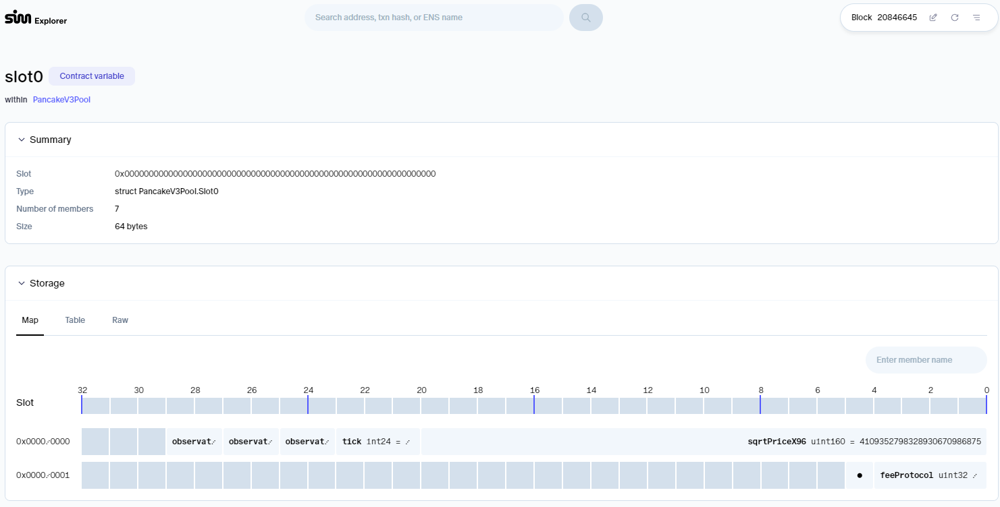
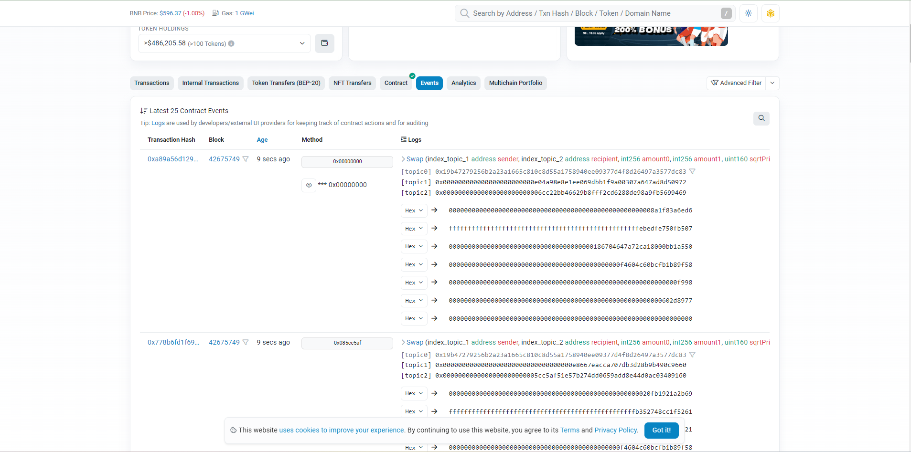
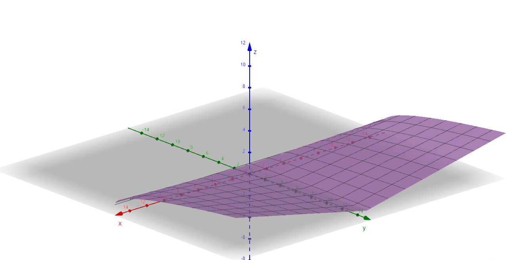

## Introduction

Using the Bollinger Bands concept to calculate volatility and reward token amounts for liquidity addition with Pancake v4 hooks and Brevis.
## Technical solution.
LiqVibe proposes two solutions to calculate the mean and standard deviation of a list of historical sqrtPriceX96:
- Use storage slot data from the Pancake V3 pool contract. This solution works on both the testnet and mainnet of BSC and Ethereum. However, it is difficult to use with the Pancake V4 Pool Manager.

- Use swap event logs from the V3 pool contract or V4 Pool Manager. This solution can integrate with both V3 and V4. However, as of now, the V4 Pool Manager is only available on the testnet.

LiqVibe proposes a formula to calculate the reward token amount when a user adds liquidity:

Reward tokens = base_reward_points + alpha * sqrt(deltaAmount) * |sqrtPriceX96 - mean| / sigma.

When sqrtPriceX96 is within the two bands, alpha = alpha0. When sqrtPriceX96 is outside the two bands, alpha = alpha1. These settings can be updated by the hookContract owner

## Coding
LiqVibe references many open-source and outdated examples, most of which are not integrated with Brevis or use incorrect RPC providers.

LiqVibe's source code has been reorganized, reducing bugs and supporting more options to test with other EVM blockchains and V3/V4 smart contracts.

All smart contracts and circuits have passed the testing scripts.
